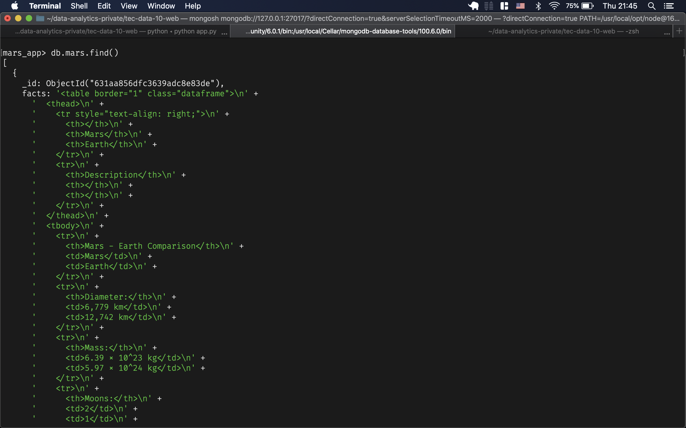

# The Web Orbit

In this challenge we moved away from our traditional data processing for analysis towards a more &ldquo;scrapy&rdquo; way of dealing with data from the web. Using our understanding of the DOM, we pulled data from various websites by accessing its HTML elements and redirected it towards our own little web app with support of a NOSQL database.


# Summary

After creating various functions to scrape specific websites for Mars data, we created a single Python file to store them.

We can take a look at our script documentation in case we want to call any of the functions individually or just use `scrape_all` in our app to execute them all.

```python
import scraping
import inspect

print(inspect.getmembers(scraping.get_image_urls)[9][1])
print(inspect.getmembers(scraping.mars_news)[9][1])
print(inspect.getmembers(scraping.mars_facts)[9][1])
```

    Extract all JPEG images and titles from all items in "https://marshemispheres.com/
    Scrape all mars news from https://redplanetscience.com/
    Get the latest mars facts from https://galaxyfacts-mars.com

After we get the data we can take a look at our mongo database to make sure we stored it correctly.

```shell
mongosh --eval "show dbs" | grep mars_app
```

    mars_app    56.00 KiB

Then inside the shell we can query our collection for documents.




# Results

Finally, our website is able to visit and scrape the webpages we set it up to scrape after pressing the `Scrape New Data` button. We also included more `Bootstrap` styling and added support for mobile displays.


# Conclusion

Web technologies are definitely the easiest and most convenient way to share data visualization and information in this day and age. We managed not only to deal with the front-end part of it but also provide endpoints for user interactivity and even connecting to existing websites. Good thing that Python supports all of that.
